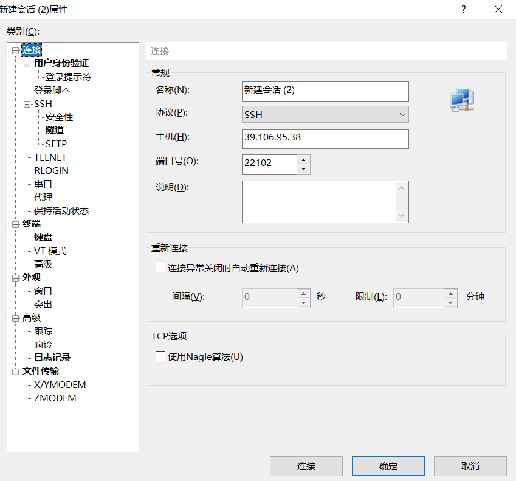
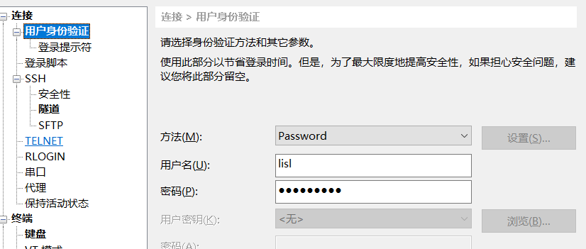
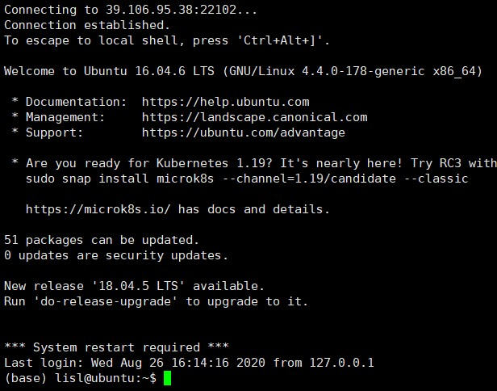
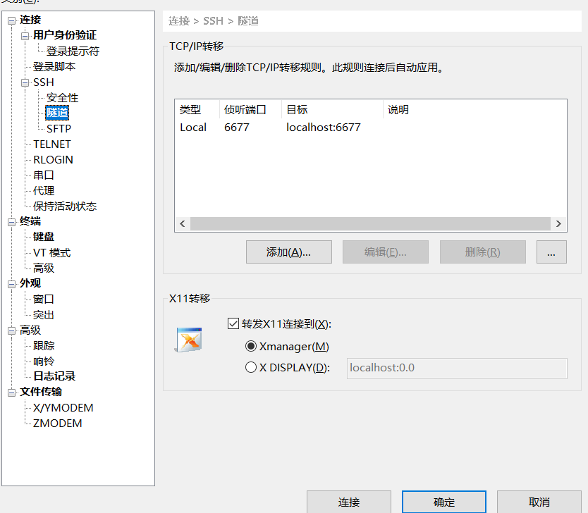
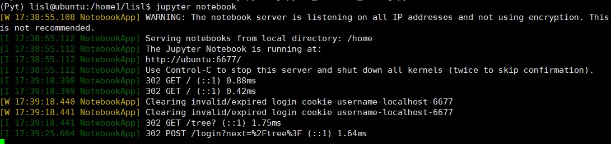
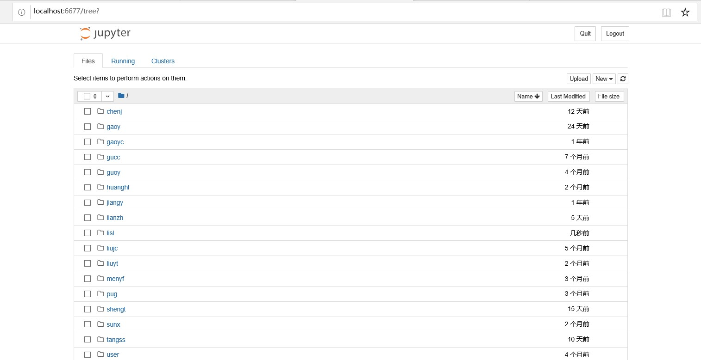

# 以windows为例通过jupyter连接远程服务器使用教程

## By lsl
## 20/08/26
## 本方法有时效性，且有的地方过于详细或者不适合所有情况如服务器路径等，且懒得很好排版，附上的链接是之前学习的时候参考的学长的在此表示感谢，仅供参考

（图片显示github相对路径都不行是真的离谱，不行就下到本地看吧）

### Step1:
下载xshell或其他ssh工具并配置连接，可以省去每次都要ssh服务器端口之类的的麻烦，以xshell为例：
新建一个会话用于连接服务器，配置服务器ip和端口：（以下是我的）

设置账号密码

之后还会继续配置隧道用于jupyter的端口转发，目前配置到这阶段应该能够连接到服务器的终端大概如下：（base为已经安装anaconda的情况）

请注意目前是在/home文件夹下，为os所在的硬盘，数据等其他东西请放在/home1文件夹下，cd /home1/（你自己的文件夹）即可

### Step2：在服务器上安装anaconda环境包，用于配置python环境和jupyter
通过命令在服务器上从清华镜像源下载anaconda安装包，比较新且稳定的版本如：
wget https://mirrors.tuna.tsinghua.edu.cn/anaconda/archive/Anaconda3-2020.02-Linux-x86_64.sh
下载完成后在目录下输入
bash 安装包名称
开始安装，步骤如果有问题可自行csdn，如果问是否下载vscode因为是服务器端就不需要

### Step3：创建python环境并安装jupyter notebook
安装了anaconda，尽量开一个虚拟python环境，通过
conda create -n 虚拟环境名字如Py
之后conda activate Py进入虚拟环境，不同环境中包不共用，避免了奇怪的版本问题，而创建的环境都是继承base环境的，所以不建议在base环境中乱搞

之后在Py环境中安装jupyter notebook执行命令（后面都是Py环境）
conda install jupyter notebook

先生成jupyter的密码：
命令行输入ipython，进入REPL环境，执行
from notebook.auth import passwd;passwd()
输入明文密码并生成hash密码，输入并不会显示，保存这个hash密码
之后REPL中exit回到命令行

之后运行命令生成配置文件：
jupyter notebook --generate-config
通过vim打开这个文件并编辑（vim对新手并不友好，如果你会就没啥事）路径如
vim /home/lisl/.jupyter/jupyter_notebook_config.py
基本操作为vim打开之后按i为插入编辑，根据一个学长的教程：
https://github.com/burning846/rookie-helper/blob/master/jupyter-notebook/README.md
修改你的配置文件，这里会用到你的hash密码，请注意端口不要默认的8888或者6677（这个是我的），选一个其他的数字作为你的端口，记住这个端口，完成后
按“：”进入命令模式，wq为保存并退出 :wq回车即可
此时你的jupyter应该能用了
输入jupyter notebook即可执行

### Step4：配置端口转发
由于jupyter notebook只运行在服务器端，你需要把数据转发到自己的电脑上
编辑你电脑上之前的那个xshell连接会话的属性，增加一个隧道：

即进行端口转发把服务器的转发到自己这边如图（由于没有跳板机还比较简单）
此时你的一个命令窗口应该在Py环境下执行这jupyter notebook大概是这样

如果还需要命令行窗口就再开一个
之后浏览器，打开 localhost:你转发的本地的端口号/ 即可打开jupyter如图

PS：由于我新手的时候安装遇到了很多坑，尽管网络上有很多教程对新手来说还是很费时间我当时安装了几乎一天才弄明白在干嘛，故在此汇总希望能免除当前是新手的人的一部分麻烦
